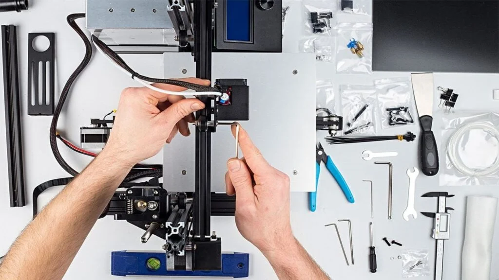
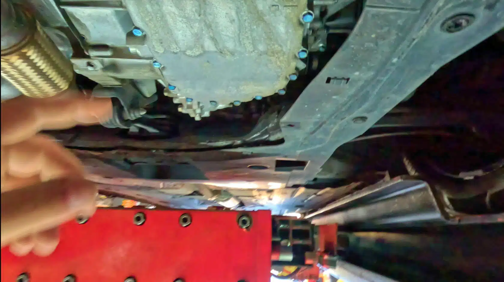
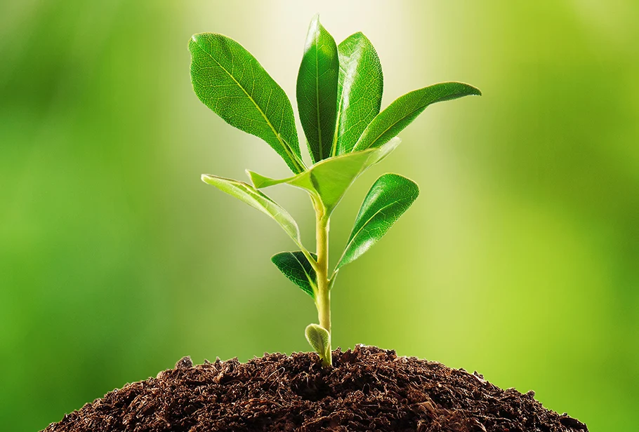

## Projects
* * *
### This website (Chemistry/Hobby)

I designed this website as a final for my chemistry class.

* * * 
### 3D Printer Rebuild

I found a broken, free 3D printer in craigslist. I am in the process of restoring it to working condition with a new motherboard and control system.

* * * 
### Engine Rebuild

As part of my automotive course, I got to dissassemble and reassemble a toyota 4-cylinder engine. 

* * * 
### Honda Civic Transmission Replacement

In my Advanced Automotive course, I was given a job too replace the transmission in a Honda Civic. This project took a month, as the replacement transmission was defective, requiring another replacement, this time repairing the original transmission. 

* * * 
### Plant Growing Project 

As part of my Agricultural Biology course, I had to grow and maintain a plant throughout the second semester.

* * * 

[back](./)
